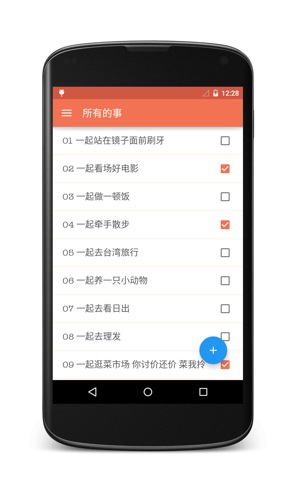
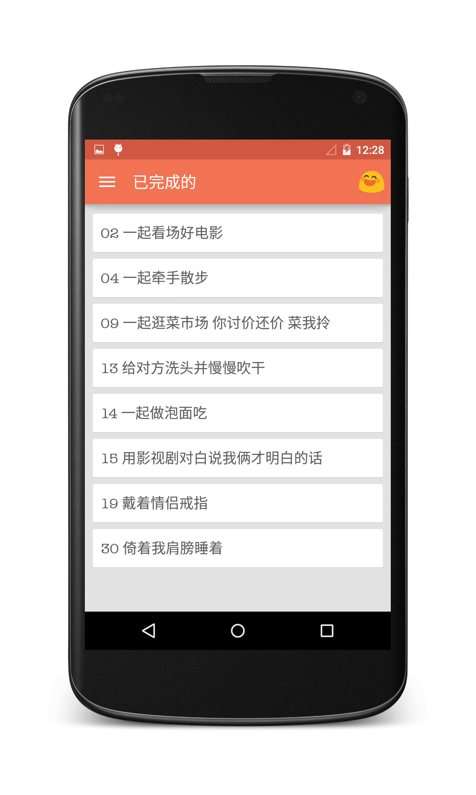
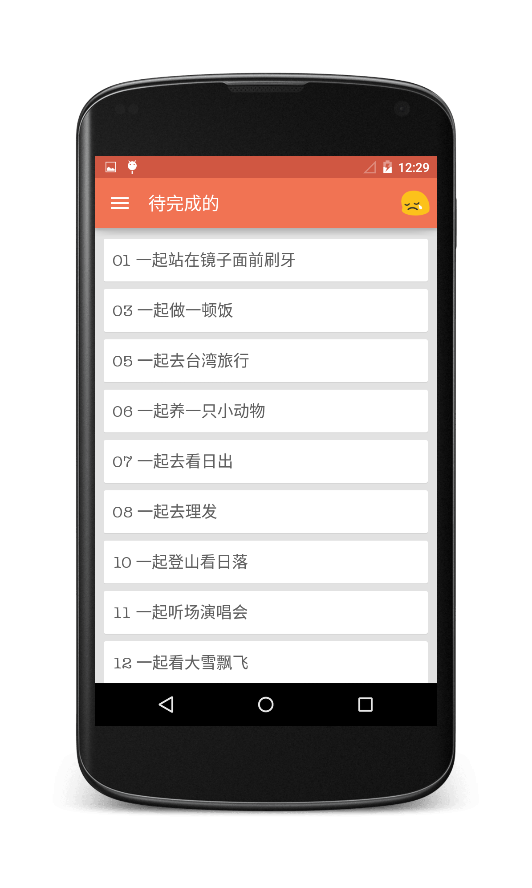

# WithY
一个很简单的情侣间的to-do-list应用。

*注:本项目使用Android Studio开发*

说明:
我做这个app的创意来自之前有一次在v2ex上看到一个iOS开发者做的一个“100 件小事”的app。
目前我跟女朋友也是异地恋中，聚少离多。看到那个帖子后，突然就想自己也写个。app中尽量多的使用了Material design。
你看到下面的关于页面的截图，我在里面我放了一个彩蛋。怎么触发就靠你了。😄。

应用截图：
===

更新日志：
===
###2015-02-17
#####1.0发布
